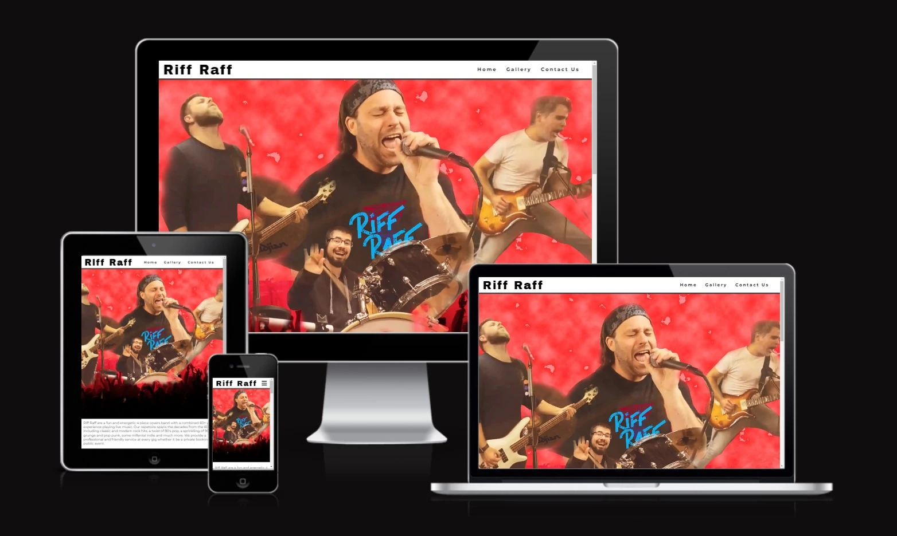
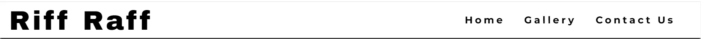
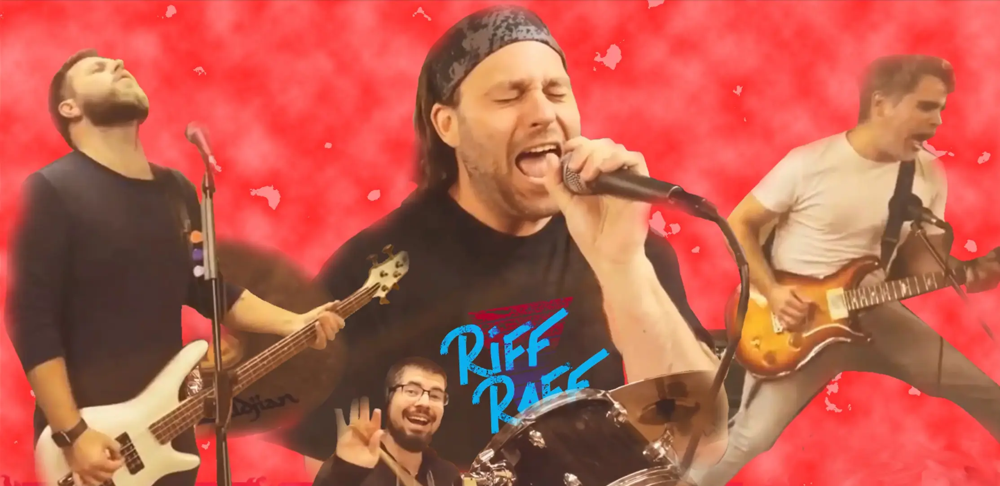
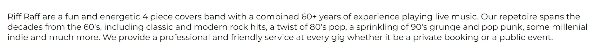
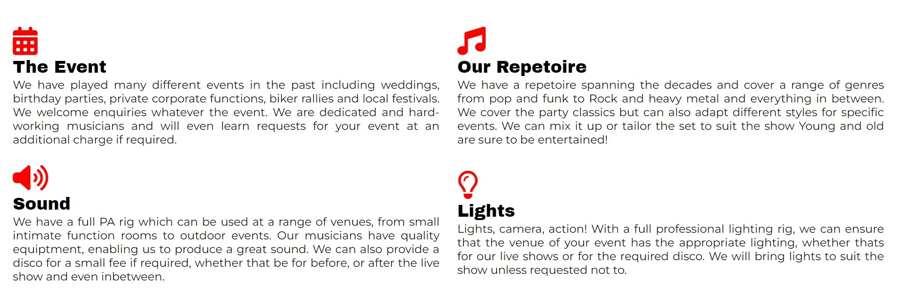
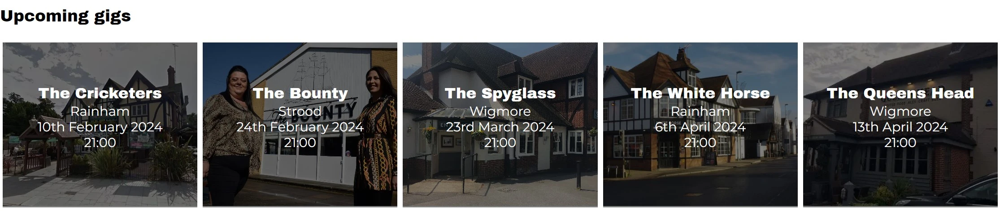
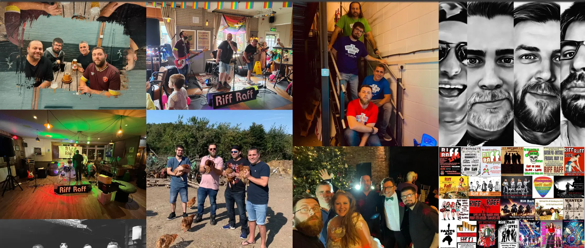
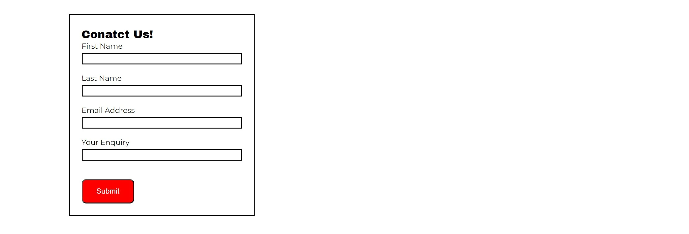
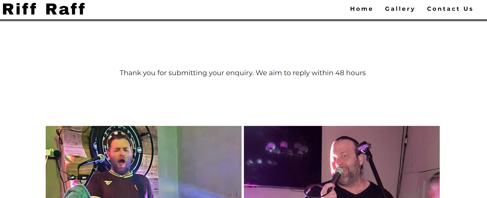

# Riff Raff- Band

Riff Raff are a rock covers band from the UK, playing venues across Kent and beyond. They play pubs and clubs and can be hired for private events.

The aim of this site is to provide users with information into who we are, what we do, what we can provide as a service and when we are playing next. There is also a page wherethey can make enquiries.

## Features

### Navigation Bar

- The navigation bar features at the top of all pages on the site
- It is fixed for easy access to navigate to the various different pages
- It provides links via the logo to the home page as well as links to the home page, gallery and a contact page
- It contains black text on a white background for accessibilty reasons
- When the user hovers over the links on the right, the text colour changes and expands the size to highlight the section

### The hero image

- The landing page displays a hero image of the band performing. This is a collage type image created in photoshop
- This is a clear image which demonstartes visually what the page is about

### About us

- The about us section is an introduction of the band describing what they are and what they can offer

### The show

- The show section is comprised of four parts; The Event, our Repetoire, Sound and Lights
- This provides more detail into the services the band can offer
- For larger screen sizes, the sections are displayed in rows and columns for a better visual UX
- Each section has an icon above it visually showing what the section is about
- The icons are in theme with the page colours

### Upcoming gigs

- This section provides users with information on upcoming shows.
- It shows the location, date and time of upcoming events
- It also displays a background image of each venue

### The footer

- The footer shows links to the various social media pages
- The social media links will open in a new tab so the user can easily return to the site
- The footer is displayed at the bottom of all pages

### The gallery

- The gallery displays images relevant to the band
- This provides a colourful visual element

### Contact Us

- The contact us page displays a form and individual band member images
- The contact form is valuable to the user as it provides a method of contacting the band for availability and quotes
- The form collects the name, email address of the user and the free text enquiry

### Thank you

- Once the form is submitted, the thank you page is displayed
- This provides a reciept to the user
- This is valuable to the user as it informs them that their request was successful and further information as to when to expect a reply

## Features left to implement

- A testomonial/ reviews page with positive reviews from previous clients
- A news section with latest news
- A section with videos and sound clips

## Design

- The main colour scheme used is black and white with hints of red that set it off to add colour and visual interest

- The font used for the logo and headings is Archivo black
- The main font used is Montserratt
- No wireframe software was used in the design. The design was scripted on pen and paper

## Technologies used

- HTML5
- CSS3

## Frameworks, libraries and programs used

- Gitpod - To write the code
- Git - Version control
- Github - Deployment and storage of files online
- Google Fonts - To select and import fonts online
- Am I responsive - To show a screenshot of the responsive design across multiple devices
- Font Awesome - Providing relevant icons
- Favicon - provides icons for the title bar

## Testing

The W3C Markup Validator and W3C CSS Validator services were used to validate every page of the project to ensure there were no errors.

[WC3 Markup validator](https://validator.w3.org/)
[w3c CSS validator](https://jigsaw.w3.org/css-validator/)

### Validation Results

### Manual Testing

### Lighthouse Report

### Bugs

## Deployment

## Credits
