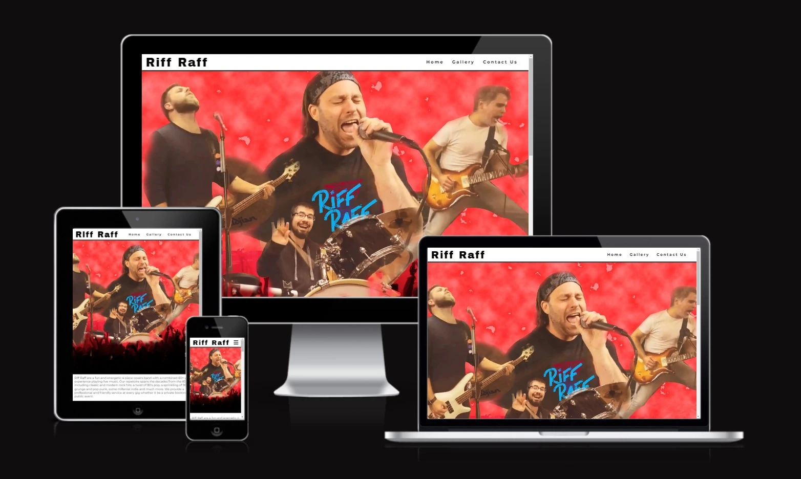
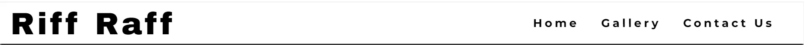
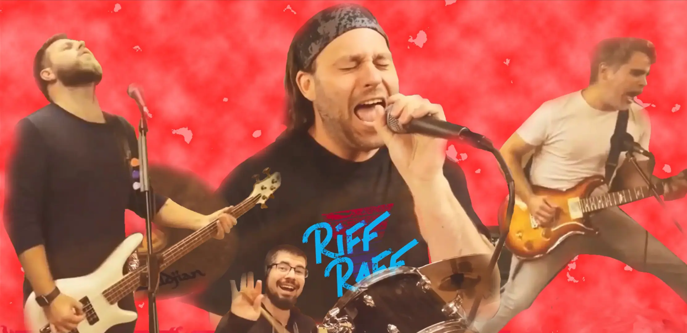
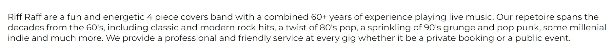
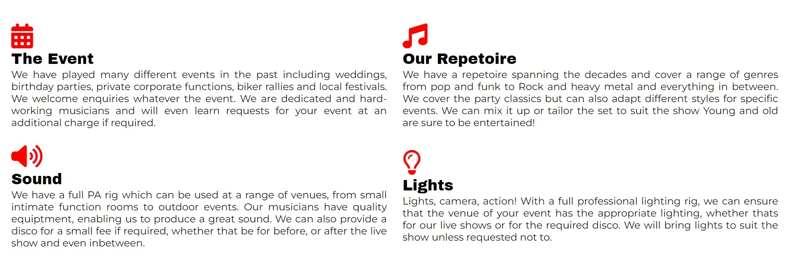
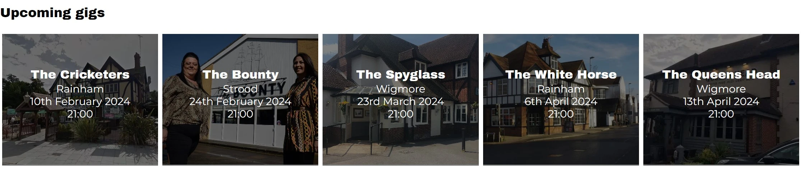
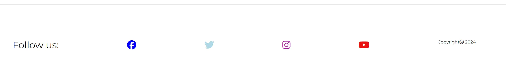
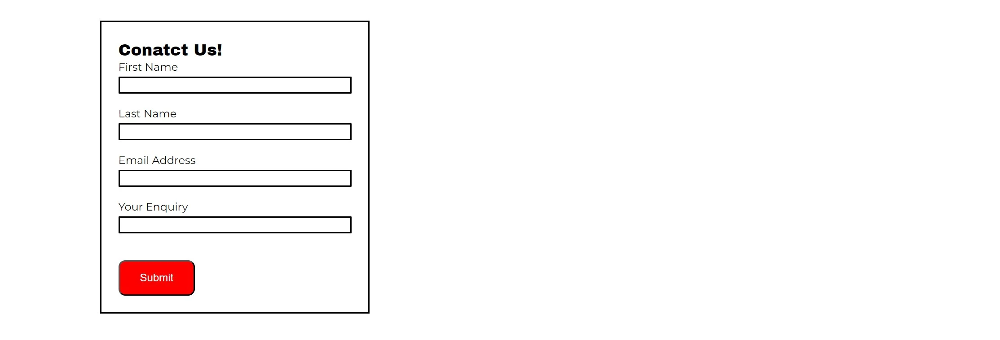
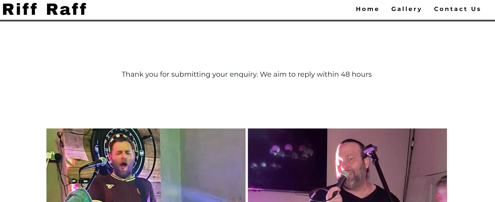
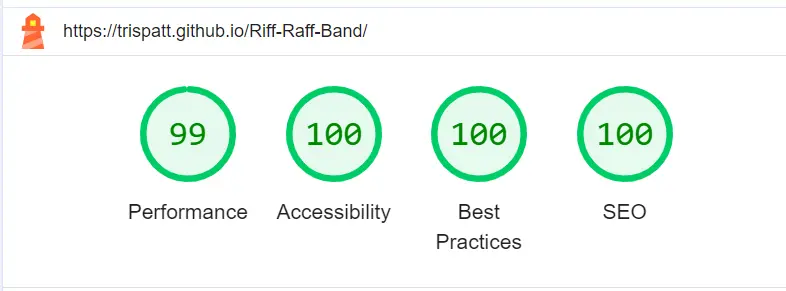

# Riff Raff- Band

Riff Raff are a rock covers band from the UK, playing venues across Kent and beyond. They play pubs and clubs and can be hired for private events.

The aim of this site is to provide users with information into who we are, what we do, what we can provide as a service and when we are playing next. There is also a page wherethey can make enquiries.

[Riff Raff Home Page](https://trispatt.github.io/Riff-Raff-Band/index.html)

## Features

### Navigation Bar

- The navigation bar features at the top of all pages on the site
- It is fixed for easy access to navigate to the various different pages
- It provides links via the logo to the home page as well as links to the home page, gallery and a contact page
- It contains black text on a white background for accessibilty reasons
- When the user hovers over the links on the right, the text colour changes and expands the text size to highlight the selection

### The hero image

- The landing page displays a hero image of the band performing. This is a collage type image created in photoshop
- This is a clear image which demonstartes visually what the page is about

### About us

- The about us section is an introduction of the band describing what they are and what they can offer

### The show

- The show section is comprised of four parts; The Event, our Repetoire, Sound and Lights
- This provides more detail into the services the band can offer
- For larger screen sizes, the sections are displayed in rows and columns for a better visual UX
- Each section has an icon above it visually showing what the section is about
- The icons are in theme with the page colours

### Upcoming gigs

- This section provides users with information on upcoming live events
- It shows the location, date and time
- It also displays a background image of each venue

### The footer

- The footer shows links to the various social media pages
- The social media links will open in a new tab so the user can easily return to the site
- The footer is displayed at the bottom of all pages

### The gallery

- The gallery displays images relevant to the band
- This provides a colourful visual element

### Contact Us

- The contact us page displays a form and individual band member images
- The contact form is valuable to the user as it provides a method of contacting the band for availability and quotes
- The form collects the name, email address of the user and the free text enquiry

### Thank you

- Once the form is submitted, the thank you page is displayed
- This provides a reciept to the user
- This is valuable to the user as it informs them that their request was successful and further information as to when to expect a reply

## Features left to implement

- A testomonial/ reviews page with positive reviews from previous clients
- A news section with latest news
- A section with videos and sound clips to create an even better user experience

## Design

- The main colour scheme used is black and white with hints of red that set it off to add colour and visual interest

- The font used for the logo and headings is Archivo black
- The main font used is Montserratt
- No wireframe software was used in the design. The design was scripted on pen and paper
- UI/UX principles were taken into account during the design process and were the reason for design and colour scheme

## Technologies used

- HTML5
- CSS3

## Frameworks, libraries and programs used

- Codeanywhere - To write the code
- Git - Version control
- Github - Deployment and storage of files online
- Google Fonts - To select and import fonts online
- Am I responsive - To show a screenshot of the responsive design across multiple devices
- Font Awesome - Provides relevant icons
- Favicon - provides icons for the title bar

## Testing

The W3C Markup Validator and W3C CSS Validator services were used to validate every page of the project to ensure there were no errors.

[WC3 Markup validator](https://validator.w3.org/)
[w3c CSS validator](https://jigsaw.w3.org/css-validator/)

### Validation Results

- HTML- No errors were returned from all pages
- CSS- No errors returned

### Manual Testing

- The website was tested on Chrome, Edge, Firefox and Safari
- Each page was tested on a Macbook pro and Surface pro 7 laptop, ipad mini, iphone XR and Honer 70 android mobile
- All links on every page were tested and work correctly
- The form on the contact page was tested, each field contains a required field and submits correctly. The thank-you page loads on submitting the form
- Dev tools was used to test various screemn sizes

### Lighthouse Report

- The lighthouse report showed excellent accessibility scores across every page for mobile and desktop
  

### Bugs

- Bug- The background colour would not show over the images to highlight the overlay text on the upcoming gigs section  
  Fix- I fixed this by wrapping another div around the text element and applying the background colour to the text rather than the div for the images
- Bug - The images of the band in the contact section were showing outside the screen on some screen sizes 
  Fix- I added the selectors to the relevant media queries and changed the size of the images so that they would show up in a row on different screen sizes
- Bug - On testing, the lighthouse report showed a bad load time for the main LCP on the home page  
  Fix - I made the fetch priority high on the index.HTML head to preload the image. This created a faster performance time

### Unfixed bug

- No outstanding unfixed bugs

## Deployment

GitHub Pages was used to deploy live versions of the website.

1. Log in to GitHub and locate [GitHub Repository Riff Raff Band](https://trispatt.github.io/Riff-Raff-Band/index.html)
2. At the top of the Repository(not the main navigation) locate "Settings" button on the menu.
3. Scroll down the Settings page until you locate "GitHub Pages".
4. Under "Source", click the dropdown menu "None" and select "Main" and click "Save".
5. The page will automatically refresh.
6. Scroll back to locate the now-published site [link](https://trispatt.github.io/Riff-Raff-Band/index.html) in the "GitHub Pages" section.

### Forking the GitHub Repository

By forking the repository, we make a copy of the original repository on our GitHub account to view and change without affecting the original repository by using these steps:

1. Log in to GitHub and locate [GitHub RepositoryRiff Raff Band](https://trispatt.github.io/Riff-Raff-Band/index.html)
2. At the top of the Repository(under the main navigation) locate "Fork" button.
3. Now you should have a copy of the original repository in your GitHub account.

### Local Clone

1. Log in to GitHub and locate [GitHub Repository Riff Raff Band](https://trispatt.github.io/Riff-Raff-Band/index.html)
2. Under the repository name click "Clone or download"
3. Click on the code button, select clone with HTTPS, SSH or GitHub CLI and copy the link shown.
4. Open Git Bash
5. Change the current working directory to the location where you want the cloned directory to be made.
6. Type `git clone` and then paste The URL copied in the step 3.
7. Press Enter and your local clone will be created.

## Credits

### Content

- All content was written by the developer
- All gallery images, contact and thank-you images are owned by the developer and the band
- The hero image was created and is owned by the developer
- Images in the gigs section were taken from the internet and are not owned by the developer
  
### Code

- Readme template supplied by the code institute